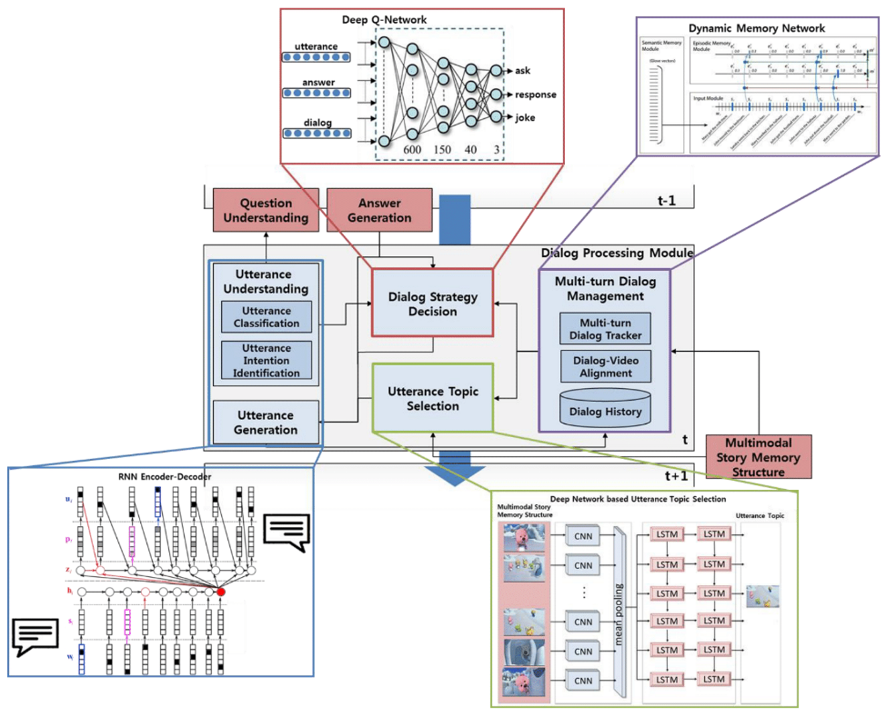
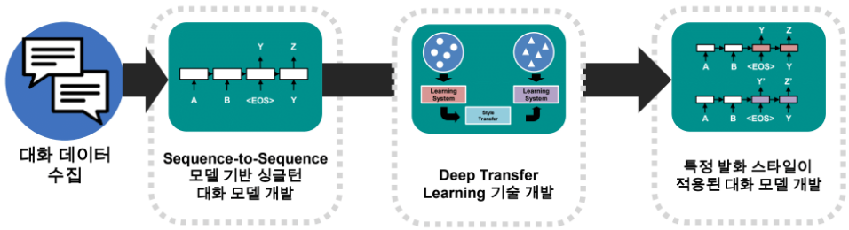

VTT과제 경북대학교 repository 입니다

# VTT (Video Turing Test)

### 질의응답 직후 후 응답 내용에 대한  follow-up  질의-응답 연쇄형태의 대화 기술 개발

    

#### 1차년도 연구내용 : 챗봇형 싱글턴 대화 모델 개발

    

- dialogue system : sequence-to-sequence 모델 기반 싱글턴 대화 모델
- setence controller : 특정 발화 스타일이 적용된 대화 모델 개발
