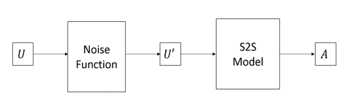

# VTT 1차년도 대화 모델

VTT 과제 1차년도 대화 모델 코드 입니다. 디노이징 메커니즘을 적용한 sequence-to-sequence 모델기반 대화 모델 입니다.
sequence-to-sequence 모델은 opensource framework인 [OpenNMT-py](https://github.com/OpenNMT/OpenNMT-py)[MIT lisence]를 상정하고 작성하였으며 repository에는 denoising mechanism 구현 코드가 업로드 되어 있습니다.

## Denoising mechanism

디노이징 메커니즘은 노이즈가 가미된 입력 데이터로부터 기존의 정답 데이터를출력하도록 모델을 학습하는 방식이다. 디노이징 메커니즘은 데이터에 노이즈를 가미해 새롭게 생성된 데이터로네트워크를 학습함으로써 데이터 증대(Data augmentation)를 통한 정규화 효과를 얻을 수 있으며 이를 통해 입력을 더 잘 나타내는 강건한 표현을 학습할 수 있다. (김태형, 노윤석, 박성배, 박세영, "한국어 대화 모델 학습을 위한 디노이징 응답 생성", 제29회 한글 및 한국어 정보처리 학술대회)
<p align="center">
    
</p>


## Description

```bash
Denoising.py
```

디노이징 메커니즘을 적용하기 위한 모듈 코드 입니다.
pytorch를 기반으로 작성하였으며 opennmt-py의 모듈로 사용가능 합니다.


* def noise_src(src, src_lengths)

Denoising mechanism에서 노이징 함수로 "drop+swap" noise가 구현된 상태입니다.
입력으로 src sequence tensor와 각 sequence의 길이를 저장하는 src_lengths tensor를 받아
노이즈를 부과하며 noise가 부과된 sequence tensor와 그에 해당하는 lengths tensor를 반환합니다.
